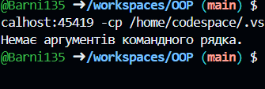

Завдання 1

```package Src.ex1;


public class Stringarg {
    public static void main(String[] args) {
        // Перевірка, чи є аргументи командного рядка
        if (args.length == 0) {
            System.out.println("Немає аргументів командного рядка.");
        } else {
            System.out.println("Аргументи командного рядка:");
            // Виведення усіх аргументів командного рядка
            for (int i = 0; i < args.length; i++) {
                System.out.println((i + 1) + ": " + args[i]);
            }
        }
    }
}
 ```
)