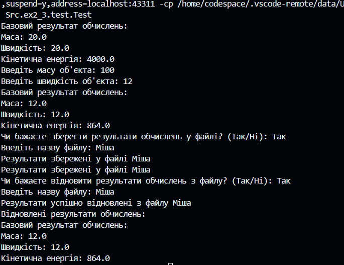
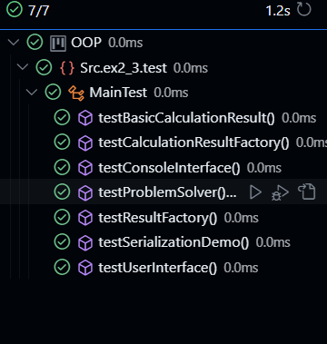

Завдання 1

```package Src.ex1;


public class Stringarg {
    public static void main(String[] args) {
        // Перевірка, чи є аргументи командного рядка
        if (args.length == 0) {
            System.out.println("Немає аргументів командного рядка.");
        } else {
            System.out.println("Аргументи командного рядка:");
            // Виведення усіх аргументів командного рядка
            for (int i = 0; i < args.length; i++) {
                System.out.println((i + 1) + ": " + args[i]);
            }
        }
    }
}
 ```


Завдання 2

CalculationResult

```package Src.ex2;

import java.io.Serializable;

/**
 * Клас, що представляє об'єкт з параметрами та результатами обчислень.
 * Цей клас може бути серіалізований.
 */
public class CalculationResult implements Serializable {
    private static final long serialVersionUID = 1L;
    
    private double mass;
    private double velocity;
    private transient double kineticEnergy; // Поле, яке не буде серіалізовано

    /**
     * Конструктор класу CalculationResult.
     * @param mass маса фізичного тіла
     * @param velocity швидкість фізичного тіла
     */
    public CalculationResult(double mass, double velocity) {
        this.mass = mass;
        this.velocity = velocity;
        this.kineticEnergy = 0.5 * mass * velocity * velocity;
    }

    /**
     * Метод для виведення результатів обчислень.
     */
    public void displayResult() {
        System.out.println("Mass: " + mass);
        System.out.println("Velocity: " + velocity);
        System.out.println("Kinetic Energy: " + kineticEnergy);
    }
}
 ```

 ProblemSolver

 ```package Src.ex2;

/**
 * Клас для знаходження рішення задачі з використанням агрегування.
 */
public class ProblemSolver {
    /**
     * Метод, що розв'язує задачу.
     * @param mass маса фізичного тіла
     * @param velocity швидкість фізичного тіла
     * @return об'єкт типу CalculationResult з результатами обчислень
     */
    public CalculationResult solveProblem(double mass, double velocity) {
        return new CalculationResult(mass, velocity);
    }
}
 ```

 SerializationDemo

 ```package Src.ex2;

import java.io.*;

/**
 * Клас для демонстрації збереження та відновлення стану об'єкта з використанням серіалізації.
 */
public class SerializationDemo {
    /**
     * Метод для збереження об'єкта у файл.
     * @param obj об'єкт для збереження
     * @param filename назва файлу, у який буде збережено об'єкт
     * @throws IOException виняток у випадку помилки вводу-виводу
     */
    public static void saveObjectToFile(CalculationResult obj, String filename) throws IOException {
        FileOutputStream fileOut = new FileOutputStream(filename);
        ObjectOutputStream out = new ObjectOutputStream(fileOut);
        out.writeObject(obj);
        out.close();
        fileOut.close();
        System.out.println("Object saved successfully to " + filename);
    }

    /**
     * Метод для відновлення об'єкта з файлу.
     * @param filename назва файлу, з якого буде відновлено об'єкт
     * @return відновлений об'єкт типу CalculationResult
     * @throws IOException виняток у випадку помилки вводу-виводу
     * @throws ClassNotFoundException виняток у випадку, якщо клас не знайдено
     */
    public static CalculationResult readObjectFromFile(String filename) throws IOException, ClassNotFoundException {
        FileInputStream fileIn = new FileInputStream(filename);
        ObjectInputStream in = new ObjectInputStream(fileIn);
        CalculationResult obj = (CalculationResult) in.readObject();
        in.close();
        fileIn.close();
        System.out.println("Object read successfully from " + filename);
        return obj;
    }
}
 ```

 Test

 ```package Src.ex2.test;

import java.io.IOException;

import Src.ex2.CalculationResult;
import Src.ex2.ProblemSolver;
import Src.ex2.SerializationDemo;

/**
 * Клас для тестування коректності результатів обчислень та серіалізації/десеріалізації.
 */
public class Test {
    public static void main(String[] args) {
        ProblemSolver solver = new ProblemSolver();
        CalculationResult result = solver.solveProblem(10.0, 20.0);
        result.displayResult();

        try {
            SerializationDemo.saveObjectToFile(result, "result.ser");
            CalculationResult deserializedResult = SerializationDemo.readObjectFromFile("result.ser");
            deserializedResult.displayResult();
        } catch (IOException | ClassNotFoundException e) {
            e.printStackTrace();
        }
    }
}
 ```

 

 Завдання 3

BasicCalculationResult

 ```package Src.ex2_3;

/**
 * Конкретна реалізація CalculationResult, що представляє певний тип результату.
 */
public class BasicCalculationResult extends CalculationResult {
    /**
     * Конструктор для створення об'єкта BasicCalculationResult з вказаною масою та швидкістю.
     *
     * @param mass     маса об'єкта
     * @param velocity швидкість об'єкта
     */
    public BasicCalculationResult(double mass, double velocity) {
        super(mass, velocity);
    }

    /**
     * Відображає результат обчислень у текстовому вигляді.
     */
    @Override
    public void displayResult() {
        System.out.println("Базовий результат обчислень:");
        System.out.println("Маса: " + mass);
        System.out.println("Швидкість: " + velocity);
        System.out.println("Кінетична енергія: " + kineticEnergy);
    }
}
 ```
 CalculationResult
 
 ```package Src.ex2_3;

/**
 * Абстрактний клас, що представляє результат обчислень.
 */
public abstract class CalculationResult {
    protected double mass;
    protected double velocity;
    protected double kineticEnergy;

    /**
     * Конструктор для створення об'єкта CalculationResult з вказаною масою та швидкістю.
     *
     * @param mass     маса об'єкта
     * @param velocity швидкість об'єкта
     */
    public CalculationResult(double mass, double velocity) {
        this.mass = mass;
        this.velocity = velocity;
        this.kineticEnergy = 0.5 * mass * velocity * velocity;
    }

    /**
     * Метод для відображення результату обчислень.
     */
    public abstract void displayResult();
}
 ```

 CalculationResultFactory

 ```package Src.ex2_3;

import java.util.ArrayList;
import java.util.List;

/**
 * Конкретна реалізація ResultFactory для CalculationResult.
 */
public class CalculationResultFactory implements ResultFactory {
    /**
     * Створює об'єкт BasicCalculationResult з вказаною масою та швидкістю.
     *
     * @param mass     маса об'єкта
     * @param velocity швидкість об'єкта
     * @return об'єкт BasicCalculationResult
     */
    @Override
    public CalculationResult create(double mass, double velocity) {
        return new BasicCalculationResult(mass, velocity);
    }

    /**
     * Зберігає результати обчислень у файлі.
     *
     * @param results  список результатів обчислень
     * @param filename назва файлу
     */
    @Override
    public void saveResultsToFile(List<CalculationResult> results, String filename) {
        // Логіка збереження результатів у файл
    }

    /**
     * Відновлює результати обчислень з файлу.
     *
     * @param filename назва файлу
     * @return список результатів обчислень
     */
    @Override
    public List<CalculationResult> loadResultsFromFile(String filename) {
        // Логіка відновлення результатів з файлу
        return new ArrayList<>();
    }
}
 ```

 ConsoleInterface
 
 ```package Src.ex2_3;

import java.util.ArrayList;
import java.util.List;
import java.util.Scanner;

/**
 * Клас, який надає консольний інтерфейс для взаємодії з користувачем.
 */
public class ConsoleInterface {

    /**
     * Головний метод програми, який взаємодіє з користувачем через консоль.
     *
     * @param args аргументи командного рядка (не використовуються)
     */
    public static void main(String[] args) {
        Scanner scanner = new Scanner(System.in);
        ResultFactory factory = new CalculationResultFactory();
        ProblemSolver solver = new ProblemSolver(factory);

        System.out.print("Введіть масу об'єкта: ");
        double mass = scanner.nextDouble();

        System.out.print("Введіть швидкість об'єкта: ");
        double velocity = scanner.nextDouble();

        CalculationResult result = solver.solveProblem(mass, velocity);
        result.displayResult();

        System.out.print("Чи бажаєте зберегти результати обчислень у файлі? (Так/Ні): ");
        String choice = scanner.next();

        if (choice.equalsIgnoreCase("Так")) {
            List<CalculationResult> results = new ArrayList<>();
            results.add(result);

            System.out.print("Введіть назву файлу: ");
            String filename = scanner.next();

            factory.saveResultsToFile(results, filename);
            System.out.println("Результати збережені у файлі " + filename);
        }

        System.out.print("Чи бажаєте відновити результати обчислень з файлу? (Так/Ні): ");
        choice = scanner.next();

        if (choice.equalsIgnoreCase("Так")) {
            System.out.print("Введіть назву файлу: ");
            String filename = scanner.next();

            List<CalculationResult> loadedResults = factory.loadResultsFromFile(filename);
            if (loadedResults != null && !loadedResults.isEmpty()) {
                System.out.println("Відновлені результати обчислень:");
                for (CalculationResult loadedResult : loadedResults) {
                    loadedResult.displayResult();
                }
            } else {
                System.out.println("Не вдалося знайти або відновити результати з файлу " + filename);
            }
        }

        scanner.close();
    }
}
 ```

 ProblemSolver

 ```package Src.ex2_3;

/**
 * Клас, який вирішує проблему, використовуючи фабрику результатів обчислень.
 */
public class ProblemSolver {
    private ResultFactory factory; // Фабрика результатів обчислень

    /**
     * Конструктор для створення об'єкта ProblemSolver з вказаною фабрикою результатів обчислень.
     *
     * @param factory фабрика результатів обчислень
     */
    public ProblemSolver(ResultFactory factory) {
        this.factory = factory;
    }

    /**
     * Розв'язує проблему з вказаною масою та швидкістю, використовуючи фабрику результатів обчислень.
     *
     * @param mass     маса об'єкта
     * @param velocity швидкість об'єкта
     * @return результат обчислень
     */
    public CalculationResult solveProblem(double mass, double velocity) {
        return factory.create(mass, velocity);
    }
}
 ```
 ResultFactory
 
 ```package Src.ex2_3;

import java.util.List;

/**
 * Інтерфейс, що представляє фабрику результатів обчислень.
 */
public interface ResultFactory {
    /**
     * Створює об'єкт результату обчислень з вказаною масою та швидкістю.
     *
     * @param mass     маса об'єкта
     * @param velocity швидкість об'єкта
     * @return об'єкт результату обчислень
     */
    CalculationResult create(double mass, double velocity);

    /**
     * Зберігає результати обчислень у файлі.
     *
     * @param results  список результатів обчислень
     * @param filename назва файлу
     */
    void saveResultsToFile(List<CalculationResult> results, String filename);

    /**
     * Відновлює результати обчислень з файлу.
     *
     * @param filename назва файлу
     * @return список результатів обчислень
     */
    List<CalculationResult> loadResultsFromFile(String filename);
}
 ```
 SerializationDemo

 ```package Src.ex2_3;

import java.io.*;

public class SerializationDemo {
    public static void saveObjectToFile(CalculationResult obj, String filename) throws IOException {
        FileOutputStream fileOut = new FileOutputStream(filename);
        ObjectOutputStream out = new ObjectOutputStream(fileOut);
        out.writeObject(obj);
        out.close();
        fileOut.close();
        System.out.println("Object saved successfully to " + filename);
    }

    public static CalculationResult readObjectFromFile(String filename) throws IOException, ClassNotFoundException {
        FileInputStream fileIn = new FileInputStream(filename);
        ObjectInputStream in = new ObjectInputStream(fileIn);
        CalculationResult obj = (CalculationResult) in.readObject();
        in.close();
        fileIn.close();
        System.out.println("Object read successfully from " + filename);
        return obj;
    }
}
  ```

  UserInterface
  
  ```package Src.ex2_3;

/**
 * Клас, що відповідає за обробку введення користувача та взаємодію.
 */
public class UserInterface {
    private ResultFactory factory;

    /**
     * Конструктор для створення об'єкта UserInterface з вказаною фабрикою результатів обчислень.
     *
     * @param factory фабрика результатів обчислень
     */
    public UserInterface(ResultFactory factory) {
        this.factory = factory;
    }

    /**
     * Виконує обчислення та відображення результату.
     *
     * @param mass     маса об'єкта
     * @param velocity швидкість об'єкта
     */
    public void performCalculationAndDisplayResult(double mass, double velocity) {
        CalculationResult result = factory.create(mass, velocity);
        result.displayResult();
    }
}

 ```
 


