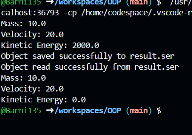

Завдання 2

CalculationResult

```package Src.ex2;

import java.io.Serializable;

/**
 * Клас, що представляє об'єкт з параметрами та результатами обчислень.
 * Цей клас може бути серіалізований.
 */
public class CalculationResult implements Serializable {
    private static final long serialVersionUID = 1L;
    
    private double mass;
    private double velocity;
    private transient double kineticEnergy; // Поле, яке не буде серіалізовано

    /**
     * Конструктор класу CalculationResult.
     * @param mass маса фізичного тіла
     * @param velocity швидкість фізичного тіла
     */
    public CalculationResult(double mass, double velocity) {
        this.mass = mass;
        this.velocity = velocity;
        this.kineticEnergy = 0.5 * mass * velocity * velocity;
    }

    /**
     * Метод для виведення результатів обчислень.
     */
    public void displayResult() {
        System.out.println("Mass: " + mass);
        System.out.println("Velocity: " + velocity);
        System.out.println("Kinetic Energy: " + kineticEnergy);
    }
}
 ```

 ProblemSolver

 ```package Src.ex2;

/**
 * Клас для знаходження рішення задачі з використанням агрегування.
 */
public class ProblemSolver {
    /**
     * Метод, що розв'язує задачу.
     * @param mass маса фізичного тіла
     * @param velocity швидкість фізичного тіла
     * @return об'єкт типу CalculationResult з результатами обчислень
     */
    public CalculationResult solveProblem(double mass, double velocity) {
        return new CalculationResult(mass, velocity);
    }
}
 ```

 SerializationDemo

 ```package Src.ex2;

import java.io.*;

/**
 * Клас для демонстрації збереження та відновлення стану об'єкта з використанням серіалізації.
 */
public class SerializationDemo {
    /**
     * Метод для збереження об'єкта у файл.
     * @param obj об'єкт для збереження
     * @param filename назва файлу, у який буде збережено об'єкт
     * @throws IOException виняток у випадку помилки вводу-виводу
     */
    public static void saveObjectToFile(CalculationResult obj, String filename) throws IOException {
        FileOutputStream fileOut = new FileOutputStream(filename);
        ObjectOutputStream out = new ObjectOutputStream(fileOut);
        out.writeObject(obj);
        out.close();
        fileOut.close();
        System.out.println("Object saved successfully to " + filename);
    }

    /**
     * Метод для відновлення об'єкта з файлу.
     * @param filename назва файлу, з якого буде відновлено об'єкт
     * @return відновлений об'єкт типу CalculationResult
     * @throws IOException виняток у випадку помилки вводу-виводу
     * @throws ClassNotFoundException виняток у випадку, якщо клас не знайдено
     */
    public static CalculationResult readObjectFromFile(String filename) throws IOException, ClassNotFoundException {
        FileInputStream fileIn = new FileInputStream(filename);
        ObjectInputStream in = new ObjectInputStream(fileIn);
        CalculationResult obj = (CalculationResult) in.readObject();
        in.close();
        fileIn.close();
        System.out.println("Object read successfully from " + filename);
        return obj;
    }
}
 ```

 Test

 ```package Src.ex2.test;

import java.io.IOException;

import Src.ex2.CalculationResult;
import Src.ex2.ProblemSolver;
import Src.ex2.SerializationDemo;

/**
 * Клас для тестування коректності результатів обчислень та серіалізації/десеріалізації.
 */
public class Test {
    public static void main(String[] args) {
        ProblemSolver solver = new ProblemSolver();
        CalculationResult result = solver.solveProblem(10.0, 20.0);
        result.displayResult();

        try {
            SerializationDemo.saveObjectToFile(result, "result.ser");
            CalculationResult deserializedResult = SerializationDemo.readObjectFromFile("result.ser");
            deserializedResult.displayResult();
        } catch (IOException | ClassNotFoundException e) {
            e.printStackTrace();
        }
    }
}
 ```
