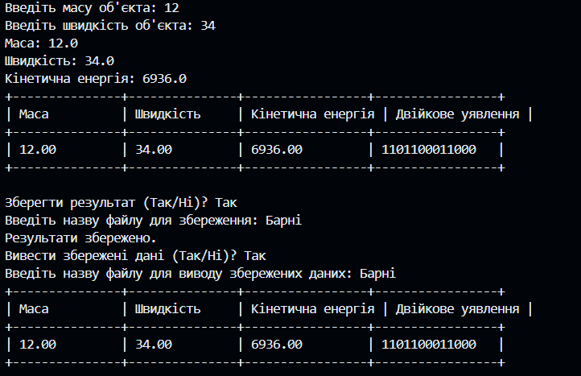
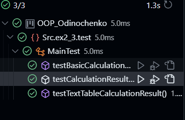

Завдання 4

Test.java

```package Src.ex2_3.test;

import Src.ex2_3.BasicCalculationResult;
import Src.ex2_3.CalculationResult;
import Src.ex2_3.CalculationResultFactory;
import Src.ex2_3.ResultFactory;
import Src.ex4.TextTableCalculationResult;

import java.io.BufferedReader;
import java.io.FileReader;
import java.io.FileWriter;
import java.io.IOException;
import java.util.ArrayList;
import java.util.List;
import java.util.Scanner;

/**
 * Клас для тестування.
 */
public class Test {

    /**
     * Метод main, який є точкою входу в програму.
     *
     * @param args масив аргументів командного рядка
     */
    public static void main(String[] args) {
        try (Scanner scanner = new Scanner(System.in)) {
            ResultFactory factory = new CalculationResultFactory(null);

            // Введення даних з клавіатури
            System.out.print("Введіть масу об'єкта: ");
            double mass = scanner.nextDouble();

            System.out.print("Введіть швидкість об'єкта: ");
            double velocity = scanner.nextDouble();

            // Розв'язання задачі та створення результату
            CalculationResult result = factory.create(mass, velocity);

            // Виведення результату у вигляді текстової таблиці
            displayResults(result, scanner);
        } catch (IOException e) {
            e.printStackTrace();
        }
    }

    /**
     * Виведення результату та запит на збереження.
     *
     * @param result  результат обчислень
     * @param scanner об'єкт для зчитування введення користувача
     * @throws IOException виняток, який виникає при роботі з файлами
     */
    private static void displayResults(CalculationResult result, Scanner scanner) throws IOException {
        System.out.println("Маса: " + result.getMass());
        System.out.println("Швидкість: " + result.getVelocity());
        System.out.println("Кінетична енергія: " + result.getKineticEnergy());

        // Виведення результату у вигляді текстової таблиці
        List<CalculationResult> resultList = new ArrayList<>();
        resultList.add(result);
        String table = TextTableCalculationResult.getAsTextTable(resultList);
        System.out.println(table);

        // Запит на збереження даних
        System.out.print("Зберегти результат (Так/Ні)? ");
        String saveChoice = scanner.next();
        if (saveChoice.equalsIgnoreCase("Так")) {
            saveToFile(result, scanner);
            System.out.println("Результати збережено.");
        } else {
            System.out.println("Результати не збережено.");
        }

        // Запит на вивід збережених даних
        System.out.print("Вивести збережені дані (Так/Ні)? ");
        String printChoice = scanner.next();
        if (printChoice.equalsIgnoreCase("Так")) {
            System.out.print("Введіть назву файлу для виводу збережених даних: ");
            String fileName = scanner.next();
            printSavedData(fileName);
        }
    }

    /**
     * Збереження результату у файл.
     *
     * @param result  результат обчислень
     * @param scanner об'єкт для зчитування введення користувача
     * @throws IOException виняток, який виникає при роботі з файлами
     */
    private static void saveToFile(CalculationResult result, Scanner scanner) throws IOException {
        System.out.print("Введіть назву файлу для збереження: ");
        String fileName = scanner.next();
        try (FileWriter writer = new FileWriter(fileName)) {
            writer.write(String.format("Маса: %.2f%n", result.getMass()));
            writer.write(String.format("Швидкість: %.2f%n", result.getVelocity()));
            writer.write(String.format("Кінетична енергія: %.2f%n", result.getKineticEnergy()));
        }
    }

    /**
     * Вивід збережених даних з файлу у вигляді таблиці.
     *
     * @param fileName назва файлу збережених даних
     * @throws IOException виняток, який виникає при роботі з файлами
     */
    private static void printSavedData(String fileName) throws IOException {
        List<CalculationResult> resultList = new ArrayList<>();
        try (BufferedReader reader = new BufferedReader(new FileReader(fileName))) {
            double mass = 0.0;
            double velocity = 0.0;
            String line;
            while ((line = reader.readLine()) != null) {
                String[] data = line.split(": ");
                if (data.length == 2) {
                    String value = data[1].trim();
                    if (data[0].equalsIgnoreCase("Маса")) {
                        mass = Double.parseDouble(value);
                    } else if (data[0].equalsIgnoreCase("Швидкість")) {
                        velocity = Double.parseDouble(value);
                    }
                }
            }
            // Створення об'єкта підкласу BasicCalculationResult з усіма необхідними даними
            BasicCalculationResult calculationResult = new BasicCalculationResult(mass, velocity);
            resultList.add(calculationResult);
        }

        // Виведення збережених даних у вигляді текстової таблиці
        String table = TextTableCalculationResult.getAsTextTable(resultList);
        System.out.println(table);
    }
}
 ```
 BasicCalculationResult.java

 ```package Src.ex2_3;

/**
 * Підклас класу CalculationResult, що представляє базовий результат обчислень.
 */
public class BasicCalculationResult extends CalculationResult {

    /**
     * Конструктор з параметрами.
     *
     * @param mass     маса об'єкта
     * @param velocity швидкість об'єкта
     */
    public BasicCalculationResult(double mass, double velocity) {
        super(mass, velocity);
    }

    @Override
    public void displayResult() {
        // TODO: Implement displayResult method
        System.out.println("Mass: " + mass);
        System.out.println("Velocity: " + velocity);
        System.out.println("Kinetic Energy: " + kineticEnergy);
    }
}
 ```
 CalculationResult.java

 ```package Src.ex2_3;

/**
 * Абстрактний клас, що представляє результат обчислень.
 */
public abstract class CalculationResult {
    protected double mass;
    protected double velocity;
    protected double kineticEnergy;

    /**
     * Конструктор з параметрами.
     *
     * @param mass     маса об'єкта
     * @param velocity швидкість об'єкта
     */
    public CalculationResult(double mass, double velocity) {
        this.mass = mass;
        this.velocity = velocity;
        this.kineticEnergy = 0.5 * mass * velocity * velocity;
    }

    /**
     * Повертає масу об'єкта.
     *
     * @return маса об'єкта
     */
    public double getMass() {
        return mass;
    }

    /**
     * Повертає швидкість об'єкта.
     *
     * @return швидкість об'єкта
     */
    public double getVelocity() {
        return velocity;
    }

    /**
     * Повертає кінетичну енергію об'єкта.
     *
     * @return кінетична енергія об'єкта
     */
    public double getKineticEnergy() {
        return kineticEnergy;
    }

    public abstract void displayResult();
}
 ```
 CalculationResultFactory.java

 ```package Src.ex2_3;

import java.io.*;
import java.util.ArrayList;
import java.util.List;

import Src.ex4.TextTableRepresentation;

/**
 * Конкретна реалізація ResultFactory для CalculationResult.
 */
public class CalculationResultFactory implements ResultFactory {
    /**
     * Конструктор з параметром, що встановлює тип представлення результатів обчислень.
     *
     * @param textTableRepresentation об'єкт, що реалізує представлення результатів у вигляді текстової таблиці
     */
    public CalculationResultFactory(TextTableRepresentation textTableRepresentation) {
    }

    // Реалізація методів create, saveResultsToFile та loadResultsFromFile

    /**
     * Створює об'єкт результату обчислень з вказаною масою та швидкістю.
     *
     * @param mass     маса об'єкта
     * @param velocity швидкість об'єкта
     * @return об'єкт результату обчислень
     */
    @Override
    public CalculationResult create(double mass, double velocity) {
        return new BasicCalculationResult(mass, velocity);
    }

    /**
     * Зберігає результати обчислень у файлі.
     *
     * @param results  список результатів обчислень
     * @param filename назва файлу
     */
    @Override
    public void saveResultsToFile(List<CalculationResult> results, String filename) {
        try (ObjectOutputStream outputStream = new ObjectOutputStream(new FileOutputStream(filename))) {
            outputStream.writeObject(results);
            System.out.println("Результати збережені у файлі " + filename);
        } catch (IOException e) {
            System.out.println("Помилка під час збереження результатів у файл " + filename);
            e.printStackTrace();
        }
    }

    /**
     * Відновлює результати обчислень з файлу.
     *
     * @param filename назва файлу
     * @return список результатів обчислень
     */
    @SuppressWarnings("unchecked")
    @Override
    public List<CalculationResult> loadResultsFromFile(String filename) {
        List<CalculationResult> loadedResults = new ArrayList<>();
        try (ObjectInputStream inputStream = new ObjectInputStream(new FileInputStream(filename))) {
            loadedResults = (List<CalculationResult>) inputStream.readObject();
            System.out.println("Результати успішно відновлені з файлу " + filename);
        } catch (IOException | ClassNotFoundException e) {
            System.out.println("Помилка під час завантаження результатів з файлу " + filename);
            e.printStackTrace();
        }
        return loadedResults;
    }

    /**
     * Повертає текстове представлення результатів обчислень у вигляді таблиці.
     *
     * @param results список результатів обчислень
     * @return текстове представлення у вигляді таблиці
     */
    public String getResultsAsTextTable(List<CalculationResult> results) {
        return TextTableRepresentation.getAsTextTable(results);
    }
}
 ```
 ResultFactory.java

 ```package Src.ex2_3;

import java.util.List;

/**
 * Інтерфейс, що представляє фабрику результатів обчислень.
 */
public interface ResultFactory {
    /**
     * Створює об'єкт результату обчислень з вказаною масою та швидкістю.
     *
     * @param mass     маса об'єкта
     * @param velocity швидкість об'єкта
     * @return об'єкт результату обчислень
     */
    CalculationResult create(double mass, double velocity);

    /**
     * Зберігає результати обчислень у файлі.
     *
     * @param results  список результатів обчислень
     * @param filename назва файлу
     */
    void saveResultsToFile(List<CalculationResult> results, String filename);

    /**
     * Відновлює результати обчислень з файлу.
     *
     * @param filename назва файлу
     * @return список результатів обчислень
     */
    List<CalculationResult> loadResultsFromFile(String filename);
}
```
TextTableCalculationResult.java

```package Src.ex4;

import Src.ex2_3.CalculationResult;

import java.util.List;

/**
 * Клас, що представляє результати обчислень у вигляді текстової таблиці.
 */
public class TextTableCalculationResult {

    /**
     * Повертає текстове представлення результатів обчислень у вигляді таблиці.
     *
     * @param results список результатів обчислень
     * @return текстове представлення у вигляді таблиці
     */
    public static String getAsTextTable(List<CalculationResult> results) {
        StringBuilder table = new StringBuilder();
        table.append(String.format("+---------------+---------------+-----------------+-----------------+%n"));
        table.append(String.format("| Маса          | Швидкість     | Кінетична енергія | Двійкове уявлення |%n"));
        table.append(String.format("+---------------+---------------+-----------------+-----------------+%n"));

        for (CalculationResult result : results) {
            // Перетворення Object на double для getMass()
            double mass = (Double) result.getMass();
            // Перетворення Object на double для getVelocity()
            double velocity = (Double) result.getVelocity();
            double kineticEnergy = 0.5 * mass * velocity * velocity;
            String binaryRepresentation = Integer.toBinaryString((int) kineticEnergy);

            table.append(String.format("| %-13.2f | %-13.2f | %-15.2f | %-15s |%n", mass, velocity, kineticEnergy, binaryRepresentation));
        }

        table.append(String.format("+---------------+---------------+-----------------+-----------------+%n"));

        return table.toString();
    }
}
 ```
 

 

