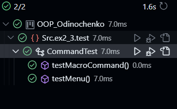
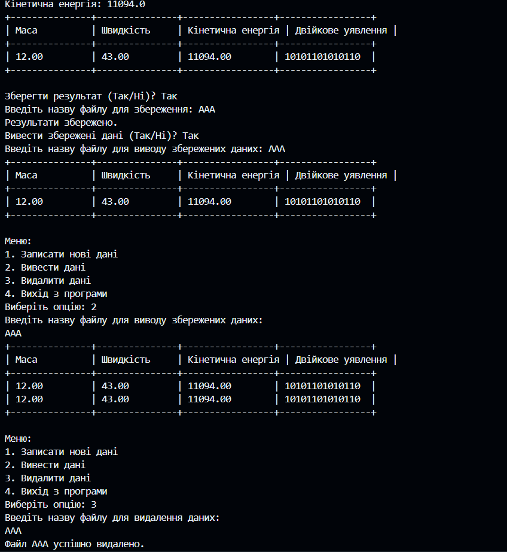

 Завдання 5

Test.java

 ```package Src.ex2_3.test;

import Src.ex2_3.BasicCalculationResult;
import Src.ex2_3.CalculationResult;
import Src.ex2_3.CalculationResultFactory;
import Src.ex2_3.ResultFactory;
import Src.ex4.TextTableCalculationResult;
import Src.ex5.*;

import java.io.*;
import java.util.ArrayList;
import java.util.List;
import java.util.Scanner;

/**
 * Клас, який містить метод main для тестування програми.
 */
public class Test {

    /**
     * Головний метод програми.
     * @param args Аргументи командного рядка (не використовуються).
     */
    public static void main(String[] args) {
        try (Scanner scanner = new Scanner(System.in)) {
            ResultFactory factory = new CalculationResultFactory(null);

            Menu menu = new Menu();

            boolean exit = false;
            while (!exit) {
                printMainMenu();
                int choice = scanner.nextInt();
                switch (choice) {
                    case 1:
                        // Записати нові дані
                        handleNewData(scanner, factory, menu);
                        break;
                    case 2:
                        // Вивести дані
                        handleDisplayData(menu, scanner);
                        break;
                    case 3:
                        // Видалити дані
                        handleDeleteData(menu, scanner);
                        break;
                    case 4:
                        // Вихід з програми
                        exit = true;
                        break;
                    default:
                        System.out.println("Невірний вибір. Будь ласка, виберіть інше значення.");
                }
            }
        } catch (IOException e) {
            e.printStackTrace();
        }
    }

    /**
     * Виводить головне меню програми.
     */
    private static void printMainMenu() {
        System.out.println("Меню:");
        System.out.println("1. Записати нові дані");
        System.out.println("2. Вивести дані");
        System.out.println("3. Видалити дані");
        System.out.println("4. Вихід з програми");
        System.out.print("Виберіть опцію: ");
    }

    /**
     * Обробляє опцію "Записати нові дані".
     * @param scanner Об'єкт Scanner для зчитування введених даних з консолі.
     * @param factory Фабрика результатів обчислення.
     * @param menu Об'єкт меню програми.
     * @throws IOException Виняток, який може виникнути при роботі з введеними даними або файлами.
     */
    private static void handleNewData(Scanner scanner, ResultFactory factory, Menu menu) throws IOException {
        // Введення даних з клавіатури
        System.out.print("Введіть масу об'єкта: ");
        double mass = scanner.nextDouble();

        System.out.print("Введіть швидкість об'єкта: ");
        double velocity = scanner.nextDouble();

        // Розв'язання задачі та створення результату
        CalculationResult result = factory.create(mass, velocity);

        // Виведення результату у вигляді текстової таблиці
        displayResults(result, scanner);

        // Збереження результату в меню
        menu.addResult(result);
    }

    private static void handleDisplayData(Menu menu, Scanner scanner) throws IOException {
        // Виведення результату з меню
        System.out.println("Введіть назву файлу для виводу збережених даних: ");
        String fileName = scanner.next();
        printSavedData(menu.getResults(), fileName);
    }

    private static void printSavedData(List<CalculationResult> resultList, String fileName) {
        try (BufferedReader reader = new BufferedReader(new FileReader(fileName))) {
            double mass = 0.0;
            double velocity = 0.0;
            String line;
            while ((line = reader.readLine()) != null) {
                String[] data = line.split(": ");
                if (data.length == 2) {
                    String value = data[1].trim();
                    if (data[0].equalsIgnoreCase("Маса")) {
                        mass = Double.parseDouble(value);
                    } else if (data[0].equalsIgnoreCase("Швидкість")) {
                        velocity = Double.parseDouble(value);
                    }
                }
            }
            BasicCalculationResult calculationResult = new BasicCalculationResult(mass, velocity);
            resultList.add(calculationResult);
        } catch (IOException e) {
            e.printStackTrace();
        }

        String table = TextTableCalculationResult.getAsTextTable(resultList);
        System.out.println(table);
    }

    private static void handleDeleteData(Menu menu, Scanner scanner) throws IOException {
        // Виведення результату з меню
        System.out.println("Введіть назву файлу для видалення даних: ");
        String fileName = scanner.next();
        deleteSavedData(menu, fileName);
    }
    
    private static void deleteSavedData(Menu menu, String fileName) {
        File fileToDelete = new File(fileName);
        if (fileToDelete.delete()) {
            System.out.println("Файл " + fileName + " успішно видалено.");
            menu.deleteResult(fileName); // Опціонально видаляємо результат з меню, якщо це необхідно
        } else {
            System.out.println("Не вдалося видалити файл " + fileName);
        }
    }
    

    private static void displayResults(CalculationResult result, Scanner scanner) throws IOException {
        System.out.println("Маса: " + result.getMass());
        System.out.println("Швидкість: " + result.getVelocity());
        System.out.println("Кінетична енергія: " + result.getKineticEnergy());

        // Виведення результату у вигляді текстової таблиці
        List<CalculationResult> resultList = new ArrayList<>();
        resultList.add(result);
        String table = TextTableCalculationResult.getAsTextTable(resultList);
        System.out.println(table);

        // Запит на збереження даних
        System.out.print("Зберегти результат (Так/Ні)? ");
        String saveChoice = scanner.next();
        if (saveChoice.equalsIgnoreCase("Так")) {
            saveToFile(result, scanner);
            System.out.println("Результати збережено.");
        } else {
            System.out.println("Результати не збережено.");
        }

        // Запит на вивід збережених даних
        System.out.print("Вивести збережені дані (Так/Ні)? ");
        String printChoice = scanner.next();
        if (printChoice.equalsIgnoreCase("Так")) {
            System.out.print("Введіть назву файлу для виводу збережених даних: ");
            String fileName = scanner.next();
            printSavedData(fileName);
        }
    }

    private static void saveToFile(CalculationResult result, Scanner scanner) throws IOException {
        System.out.print("Введіть назву файлу для збереження: ");
        String fileName = scanner.next();
        try (FileWriter writer = new FileWriter(fileName)) {
            writer.write(String.format("Маса: %.2f%n", result.getMass()));
            writer.write(String.format("Швидкість: %.2f%n", result.getVelocity()));
            writer.write(String.format("Кінетична енергія: %.2f%n", result.getKineticEnergy()));
        }
    }

    private static void printSavedData(String fileName) throws IOException {
        List<CalculationResult> resultList = new ArrayList<>();
        try (BufferedReader reader = new BufferedReader(new FileReader(fileName))) {
            double mass = 0.0;
            double velocity = 0.0;
            String line;
            while ((line = reader.readLine()) != null) {
                String[] data = line.split(": ");
                if (data.length == 2) {
                    String value = data[1].trim();
                    if (data[0].equalsIgnoreCase("Маса")) {
                        mass = Double.parseDouble(value);
                    } else if (data[0].equalsIgnoreCase("Швидкість")) {
                        velocity = Double.parseDouble(value);
                    }
                }
            }
            BasicCalculationResult calculationResult = new BasicCalculationResult(mass, velocity);
            resultList.add(calculationResult);
        }

        String table = TextTableCalculationResult.getAsTextTable(resultList);
        System.out.println(table);
    }
} 
```
Comand.java

```package Src.ex5;

/**
 * Інтерфейс команди, яка визначає методи для виконання та скасування команди.
 */
public interface Command {
    /**
     * Виконує команду.
     */
    void execute();

    /**
     * Скасовує виконану команду.
     */
    void undo();
}

 ```

 MacroComand.java

 ```package Src.ex5;

import java.util.ArrayList;
import java.util.List;

/**
 * Клас, який представляє макрокоманду, що складається з декількох окремих команд.
 */
public class MacroCommand implements Command {
    private List<Command> commands;

    /**
     * Конструктор класу MacroCommand.
     */
    public MacroCommand() {
        this.commands = new ArrayList<>();
    }

    /**
     * Додає команду до макрокоманди.
     * @param command Додавана команда.
     */
    public void addCommand(Command command) {
        commands.add(command);
    }

    /**
     * Видаляє команду з макрокоманди.
     * @param command Видаляєма команда.
     */
    public void removeCommand(Command command) {
        commands.remove(command);
    }

    /**
     * Виконує всі команди макрокоманди.
     */
    @Override
    public void execute() {
        for (Command command : commands) {
            command.execute();
        }
    }

    /**
     * Скасовує виконані команди макрокоманди в зворотньому порядку.
     */
    @Override
    public void undo() {
        // Виконуємо скасування команд у зворотньому порядку
        for (int i = commands.size() - 1; i >= 0; i--) {
            commands.get(i).undo();
        }
    }
}
 ```
 
 Menu.java

 ```package Src.ex5;

import java.util.ArrayList;
import java.util.HashMap;
import java.util.List;
import java.util.Map;

import Src.ex2_3.CalculationResult;

/**
 * Клас, який представляє меню програми.
 */
public class Menu {
    private List<CalculationResult> resultList;
    private Map<String, Command> commands;

    /**
     * Конструктор класу Menu.
     */
    public Menu() {
        this.resultList = new ArrayList<>();
        this.commands = new HashMap<>();
    }

    /**
     * Додає результат обчислення до списку результатів у меню.
     * @param result Результат обчислення.
     */
    public void addResult(CalculationResult result) {
        resultList.add(result);
    }

    /**
     * Повертає список результатів обчислення.
     * @return Список результатів обчислення.
     */
    public List<CalculationResult> getResults() {
        return resultList;
    }

    /**
     * Видаляє результат обчислення з меню за заданим ім'ям файлу.
     * @param fileName Ім'я файлу з результатом обчислення.
     */
    public void deleteResult(String fileName) {
        CalculationResult resultToRemove = null;
        for (CalculationResult result : resultList) {
            if (result.getFileName().equals(fileName)) {
                resultToRemove = result;
                break;
            }
        }
        if (resultToRemove != null) {
            resultList.remove(resultToRemove);
            System.out.println("Результат " + fileName + " успішно видалено з меню.");
        } else {
            System.out.println("Не вдалося знайти результат " + fileName + " для видалення.");
        }
    }

    /**
     * Додає команду до меню за заданим ім'ям.
     * @param commandName Ім'я команди.
     * @param command Об'єкт команди.
     */
    public void setCommand(String commandName, Command command) {
        commands.put(commandName, command);
    }

    /**
     * Повертає команду за заданим ім'ям.
     * @param commandName Ім'я команди.
     * @return Об'єкт команди або null, якщо команда не знайдена.
     */
    public Command getCommand(String commandName) {
        return commands.get(commandName);
    }
}
 ```

 ScaleCommand.java

 ```package Src.ex5;

import Src.ex2_3.CalculationResult;

/**
 * Клас, який представляє команду масштабування результату обчислення.
 */
public class ScaleCommand implements Command {
    private CalculationResult result;
    private double scaleFactor;
    private double inverseScaleFactor;

    /**
     * Конструктор класу ScaleCommand.
     * @param result Результат обчислення, який буде масштабований.
     * @param scaleFactor Коефіцієнт масштабування.
     */
    public ScaleCommand(CalculationResult result, double scaleFactor) {
        this.result = result;
        this.scaleFactor = scaleFactor;
        this.inverseScaleFactor = 1.0 / scaleFactor;
    }

    /**
     * Статичний метод для створення єдиного екземпляру класу.
     * @param result Результат обчислення, який буде масштабований.
     * @param scaleFactor Коефіцієнт масштабування.
     * @return Об'єкт класу ScaleCommand.
     */
    public static ScaleCommand createInstance(CalculationResult result, double scaleFactor) {
        return new ScaleCommand(result, scaleFactor);
    }

    /**
     * Виконує масштабування результату обчислення.
     */
    @Override
    public void execute() {
        // Виконати масштабування
        result.setMass(result.getMass() * scaleFactor);
        result.setVelocity(result.getVelocity() * scaleFactor);
        result.setKineticEnergy(result.getKineticEnergy() * scaleFactor);
    }

    /**
     * Скасовує масштабування результату обчислення.
     */
    @Override
    public void undo() {
        // Скасувати масштабування
        result.setMass(result.getMass() * inverseScaleFactor);
        result.setVelocity(result.getVelocity() * inverseScaleFactor);
        result.setKineticEnergy(result.getKineticEnergy() * inverseScaleFactor);
    }
}
 ```
 
 
