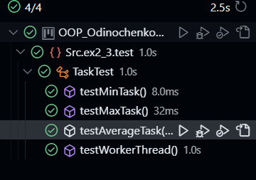
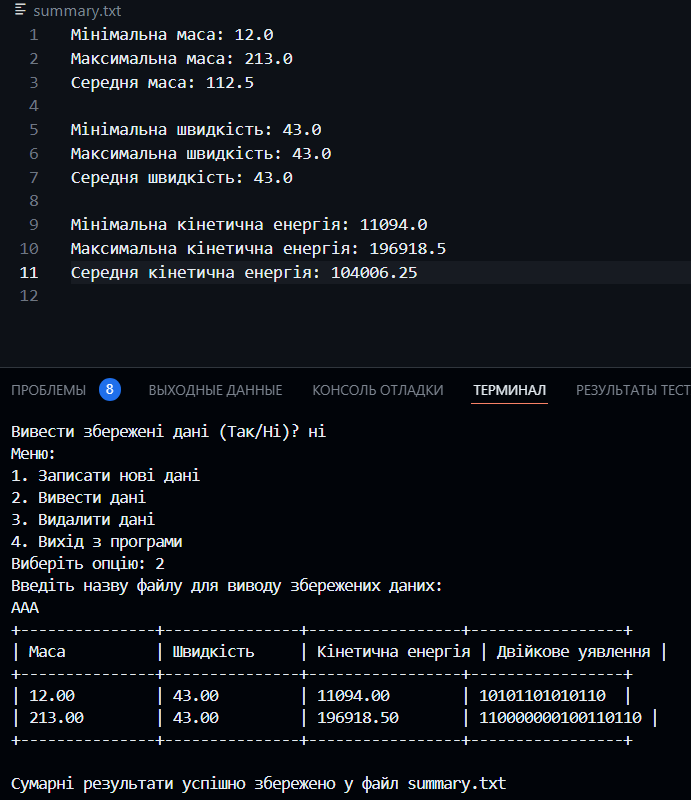

 Завдання 6

 Test.java

 ```package Src.ex2_3.test;

import Src.ex2_3.BasicCalculationResult;
import Src.ex2_3.CalculationResult;
import Src.ex2_3.CalculationResultFactory;
import Src.ex2_3.ResultFactory;
import Src.ex4.TextTableCalculationResult;
import Src.ex5.*;
import Src.ex6.AverageTask;
import Src.ex6.MaxTask;
import Src.ex6.MinTask;
import Src.ex6.WorkerThread;

import java.io.*;
import java.util.ArrayList;
import java.util.List;
import java.util.Scanner;
import java.util.concurrent.BlockingQueue;
import java.util.concurrent.ExecutorService;
import java.util.concurrent.Executors;
import java.util.concurrent.LinkedBlockingQueue;


public class Test {
    public static void main(String[] args) {
        try (Scanner scanner = new Scanner(System.in)) {
            BlockingQueue<Runnable> taskQueue = new LinkedBlockingQueue<>();
            List<Double> numbers = new ArrayList<>();

            taskQueue.add(new MinTask(numbers));
            taskQueue.add(new MaxTask(numbers));
            taskQueue.add(new AverageTask(numbers));

            ExecutorService executorService = Executors.newFixedThreadPool(5);
            for (int i = 0; i < 5; i++) {
                executorService.execute(new WorkerThread(taskQueue));
            }

            executorService.shutdown();

            ResultFactory factory = new CalculationResultFactory(null);
            Menu menu = new Menu();

            boolean exit = false;
            while (!exit) {
                printMainMenu();
                int choice = scanner.nextInt();
                switch (choice) {
                    case 1:
                        handleNewData(scanner, factory, menu);
                        break;
                    case 2:
                        handleDisplayData(menu, scanner);
                        break;
                    case 3:
                        handleDeleteData(menu, scanner);
                        break;
                    case 4:
                        exit = true;
                        break;
                    default:
                        System.out.println("Невірний вибір. Будь ласка, виберіть інше значення.");
                }
            }

            executorService.shutdown();
        } catch (IOException e) {
            e.printStackTrace();
        }
    }

    private static void printMainMenu() {
        System.out.println("Меню:");
        System.out.println("1. Записати нові дані");
        System.out.println("2. Вивести дані");
        System.out.println("3. Видалити дані");
        System.out.println("4. Вихід з програми");
        System.out.print("Виберіть опцію: ");
    }

    private static void handleNewData(Scanner scanner, ResultFactory factory, Menu menu) throws IOException {
        System.out.print("Введіть масу об'єкта: ");
        double mass = scanner.nextDouble();

        System.out.print("Введіть швидкість об'єкта: ");
        double velocity = scanner.nextDouble();

        CalculationResult result = factory.create(mass, velocity);

        displayResults(result, scanner);

        menu.addResult(result);
    }

    private static void handleDisplayData(Menu menu, Scanner scanner) throws IOException {
        System.out.println("Введіть назву файлу для виводу збережених даних: ");
        String fileName = scanner.next();
        printSavedData(menu.getResults(), fileName);

        saveSummaryToFile(menu.getResults(), "summary.txt");
    }

    private static void printSavedData(List<CalculationResult> resultList, String fileName) {
        try (BufferedReader reader = new BufferedReader(new FileReader(fileName))) {
            double mass = 0.0;
            double velocity = 0.0;
            String line;
            while ((line = reader.readLine()) != null) {
                String[] data = line.split(": ");
                if (data.length == 2) {
                    String value = data[1].trim();
                    if (data[0].equalsIgnoreCase("Маса")) {
                        mass = Double.parseDouble(value);
                    } else if (data[0].equalsIgnoreCase("Швидкість")) {
                        velocity = Double.parseDouble(value);
                    }
                }
            }
            BasicCalculationResult calculationResult = new BasicCalculationResult(mass, velocity);
            resultList.add(calculationResult);
        } catch (IOException e) {
            e.printStackTrace();
        }

        String table = TextTableCalculationResult.getAsTextTable(resultList);
        System.out.println(table);
    }

    private static void handleDeleteData(Menu menu, Scanner scanner) throws IOException {
        System.out.println("Введіть назву файлу для видалення даних: ");
        String fileName = scanner.next();
        deleteSavedData(menu, fileName);
    }

    private static void deleteSavedData(Menu menu, String fileName) {
        File fileToDelete = new File(fileName);
        if (fileToDelete.delete()) {
            System.out.println("Файл " + fileName + " успішно видалено.");
            menu.deleteResult(fileName);
        } else {
            System.out.println("Не вдалося видалити файл " + fileName);
        }
    }

    private static void displayResults(CalculationResult result, Scanner scanner) throws IOException {
        System.out.println("Маса: " + result.getMass());
        System.out.println("Швидкість: " + result.getVelocity());
        System.out.println("Кінетична енергія: " + result.getKineticEnergy());

        List<CalculationResult> resultList = new ArrayList<>();
        resultList.add(result);
        String table = TextTableCalculationResult.getAsTextTable(resultList);
        System.out.println(table);

        System.out.print("Зберегти результат (Так/Ні)? ");
        String saveChoice = scanner.next();
        if (saveChoice.equalsIgnoreCase("Так")) {
            saveToFile(result, scanner);
            System.out.println("Результати збережено.");
        } else {
            System.out.println("Результати не збережено.");
        }

        System.out.print("Вивести збережені дані (Так/Ні)? ");
        String printChoice = scanner.next();
        if (printChoice.equalsIgnoreCase("Так")) {
            System.out.print("Введіть назву файлу для виводу збережених даних: ");
            String fileName = scanner.next();
            printSavedData(fileName);
        }
    }

    private static void saveToFile(CalculationResult result, Scanner scanner) throws IOException {
        System.out.print("Введіть назву файлу для збереження: ");
        String fileName = scanner.next();
        try (FileWriter writer = new FileWriter(fileName)) {
            writer.write(String.format("Маса: %.2f%n", result.getMass()));
            writer.write(String.format("Швидкість: %.2f%n", result.getVelocity()));
            writer.write(String.format("Кінетична енергія: %.2f%n", result.getKineticEnergy()));
        }
    }

    private static void printSavedData(String fileName) throws IOException {
        List<CalculationResult> resultList = new ArrayList<>();
        try (BufferedReader reader = new BufferedReader(new FileReader(fileName))) {
            double mass = 0.0;
            double velocity = 0.0;
            String line;
            while ((line = reader.readLine()) != null) {
                String[] data = line.split(": ");
                if (data.length == 2) {
                    String value = data[1].trim();
                    if (data[0].equalsIgnoreCase("Маса")) {
                        mass = Double.parseDouble(value);
                    } else if (data[0].equalsIgnoreCase("Швидкість")) {
                        velocity = Double.parseDouble(value);
                    }
                }
            }
            BasicCalculationResult calculationResult = new BasicCalculationResult(mass, velocity);
            resultList.add(calculationResult);
        }

        String table = TextTableCalculationResult.getAsTextTable(resultList);
        System.out.println(table);
    }

    private static void saveSummaryToFile(List<CalculationResult> resultList, String fileName) {
        try (FileWriter writer = new FileWriter(fileName)) {
            double minMass = Double.MAX_VALUE;
            double maxMass = Double.MIN_VALUE;
            double sumMass = 0;
            double minVelocity = Double.MAX_VALUE;
            double maxVelocity = Double.MIN_VALUE;
            double sumVelocity = 0;
            double minKineticEnergy = Double.MAX_VALUE;
            double maxKineticEnergy = Double.MIN_VALUE;
            double sumKineticEnergy = 0;

            for (CalculationResult result : resultList) {
                double mass = result.getMass();
                double velocity = result.getVelocity();
                double kineticEnergy = result.getKineticEnergy();

                if (mass < minMass) {
                    minMass = mass;
                }
                if (mass > maxMass) {
                    maxMass = mass;
                }
                sumMass += mass;

                if (velocity < minVelocity) {
                    minVelocity = velocity;
                }
                if (velocity > maxVelocity) {
                    maxVelocity = velocity;
                }
                sumVelocity += velocity;

                if (kineticEnergy < minKineticEnergy) {
                    minKineticEnergy = kineticEnergy;
                }
                if (kineticEnergy > maxKineticEnergy) {
                    maxKineticEnergy = kineticEnergy;
                }
                sumKineticEnergy += kineticEnergy;
            }

            writer.write("Мінімальна маса: " + minMass + "\n");
            writer.write("Максимальна маса: " + maxMass + "\n");
            writer.write("Середня маса: " + (sumMass / resultList.size()) + "\n");
            writer.write("\n");
            writer.write("Мінімальна швидкість: " + minVelocity + "\n");
            writer.write("Максимальна швидкість: " + maxVelocity + "\n");
            writer.write("Середня швидкість: " + (sumVelocity / resultList.size()) + "\n");
            writer.write("\n");
            writer.write("Мінімальна кінетична енергія: " + minKineticEnergy + "\n");
            writer.write("Максимальна кінетична енергія: " + maxKineticEnergy + "\n");
            writer.write("Середня кінетична енергія: " + (sumKineticEnergy / resultList.size()) + "\n");

            System.out.println("Сумарні результати успішно збережено у файл " + fileName);
        } catch (IOException e) {
            System.out.println("Помилка при збереженні сумарних результатів у файл: " + e.getMessage());
        }
    }
}
 ```

 AverageTask.java

 ```package Src.ex6;

import java.util.List;

public class AverageTask implements Runnable {
    private final List<Double> numbers;
    private double average;

    public AverageTask(List<Double> numbers) {
        this.numbers = numbers;
    }

    @Override
    public void run() {
        double sum = numbers.stream().mapToDouble(Double::doubleValue).sum();
        average = sum / numbers.size();
        System.out.println("Середнє значення: " + average);
    }

    public double getAverage() {
        return average;
    }
}
 ```

 MaxTask.java

 ```package Src.ex6;

import java.util.List;

public class MaxTask implements Runnable {
    private final List<Double> numbers;
    private double max;

    public MaxTask(List<Double> numbers) {
        this.numbers = numbers;
    }

    @Override
    public void run() {
        max = numbers.stream().max(Double::compareTo).orElse(0.0);
        System.out.println("Максимум: " + max);
    }

    public double getMax() {
        return max;
    }
}
 ```

 MinTask.java

 ```package Src.ex6;

import java.util.List;

public class MinTask implements Runnable {
    private final List<Double> numbers;
    private double min;

    public MinTask(List<Double> numbers) {
        this.numbers = numbers;
    }

    @Override
    public void run() {
        min = numbers.stream().min(Double::compareTo).orElse(0.0);
        System.out.println("Мінімум: " + min);
    }

    public double getMin() {
        return min;
    }
}
 ```

WorkerThread.java

```package Src.ex6;

import java.util.concurrent.BlockingQueue;

public class WorkerThread implements Runnable {
    private final BlockingQueue<Runnable> taskQueue;

    public WorkerThread(BlockingQueue<Runnable> taskQueue) {
        this.taskQueue = taskQueue;
    }

    @Override
    public void run() {
        while (!Thread.currentThread().isInterrupted()) {
            try {
                Runnable task = taskQueue.take();
                task.run();
            } catch (InterruptedException e) {
                Thread.currentThread().interrupt();
            }
        }
    }
}
 ```
 
 